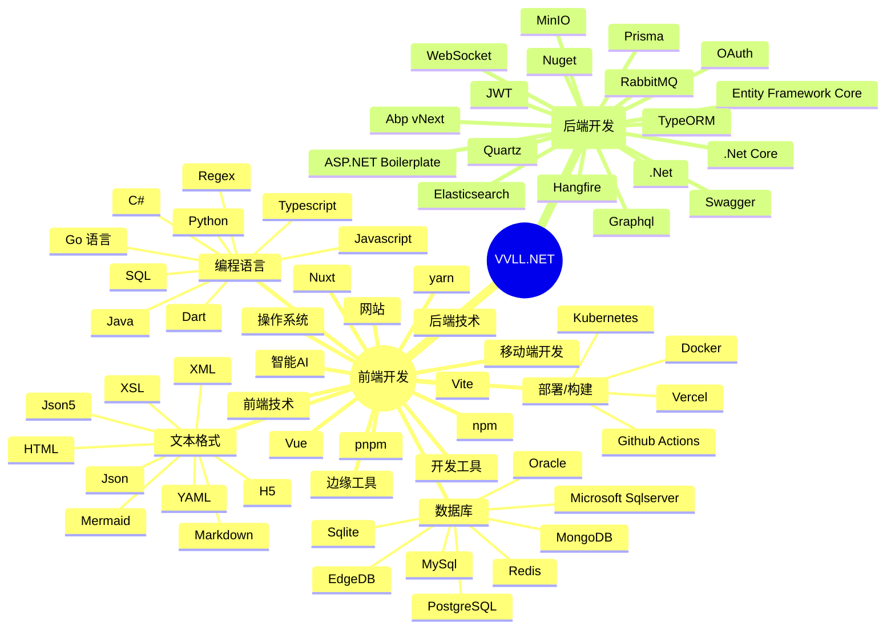
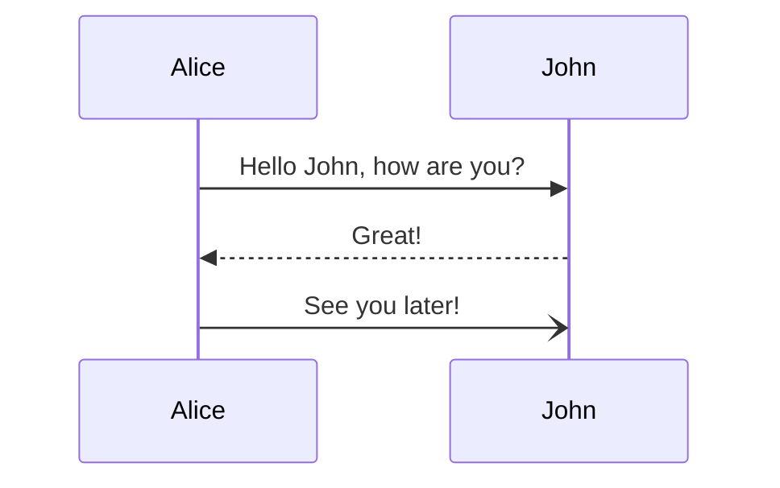
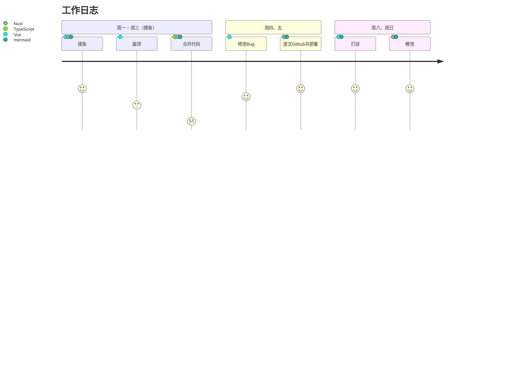
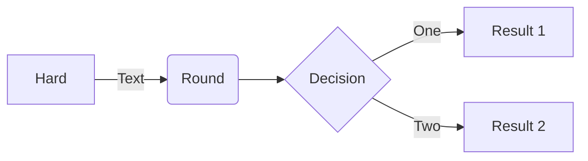

## 最新动态

:LatestPosts{:limit=12}

### 思维导图









## 安装

> 安装依赖

```
<!-- sequence -->
A->B:helo
Note right of B: blob
B-->A:aaa

```

::CodeTab{:active=0 npm=中文 npm-icon='logos:yarn' yarn=英文 yarn-icon='logos:npm-icon' pnpm-icon='logos:pnpm'}

#npm

```bash [default.txt]
# npm
`default`
```

#yarn

```js [tab.js]
// yarn
const tab = 'tab';
```

#pnpm

```js [tab.js]
// pnpm
const tab = 'tab';
```

::

This page corresponds to the `/` route of your website. You can delete it or create another file in the `content/` directory.

Try to navigate to [about](about.md). These 2 pages are rendered by the `pages/[...slug].vue` component.

---

```txt
“不积跬(kuǐ)步，无以至千里；不积小流，无以成江海。”——荀子
```

---

```css
@layer components {
  .box {
    @apply border border-slate-200 rounded-lg p-2 dark:border-slate-700;
  }
  .box-hover {
    @apply border-green-100 dark:border-green-700;
  }
  .card {
    @apply box bg-slate-100 dark:bg-slate-800;
  }
  .card-hover {
    @apply box-hover bg-green-500 bg-opacity-20;
  }
}
```

## Yaml/yml

```yaml [_dir.yml] {.mt-4}
title: Content Home
icon: ic:outline-house
```

```yml
title: Content Home
icon: ic:outline-house
```

```vue
<script lang="ts" setup>
const props = defineProps<{
  title?: string;
  description?: string;
  hover?: boolean;
}>();
</script>

<template>
  <div
    class="p-4 space-y-2 rounded-lg box"
    :class="{ 'hover:box-hover': hover }"
  >
    <slot>{{ description }}</slot>
  </div>
</template>
<style scoped>
.box > * {
  @apply m-0;
}
</style>
```

```json
{
  "name": "zhongpei",
  "index": 99
}
```
