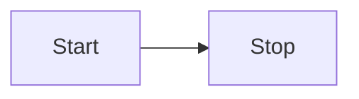
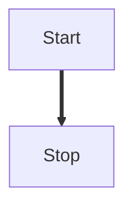
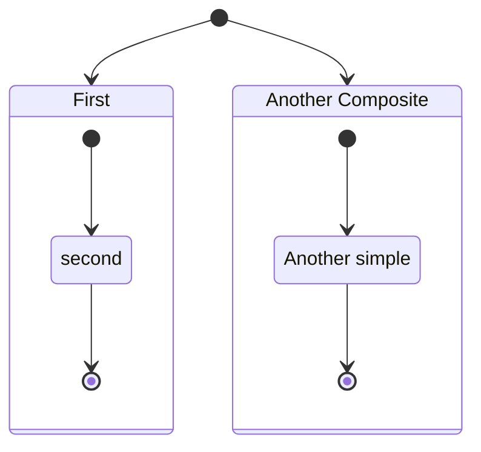
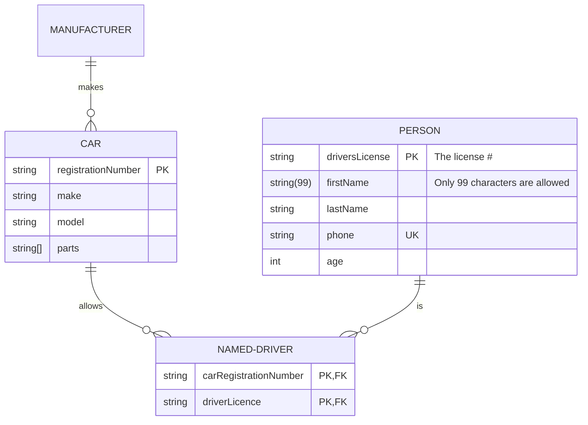

## mermaid

### github

:github{repo=https://github.com/mermaid-js/mermaid}

### 中文文档

https://mermaid.nodejs.cn/

### 英文文档

https://mermaid.js.org/intro/

### 在线编辑器

https://mermaid.live/

### 语法

## 流程图 flowchart

```md
flowchart LR
Start --> Stop
```





### 方向

可能的流程图方向是：

- `TB` - 从上到下
- `TD` - 自上而下/与自上而下相同
- `BT` - 从下到上
- `RL` - 右到左
- `LR` - 左到右

### 节点形状

### 节点之间的链接

## 序列图 sequenceDiagram

## 类图 classDiagram

## 状态图 stateDiagram-v2



## 实体关系图 erDiagram



## 用户旅程图

## 甘特图

## 饼图

## 象限图

## 需求图

## Gitgraph (Git) 图

## C4 图 🦺⚠️

## 思维导图

## 时间线图

## Zenuml

## 桑基图 🔥

## XYChart 🔥

## Block Diagram 🔥

## Packet 🔥
