## 序列图 sequenceDiagram

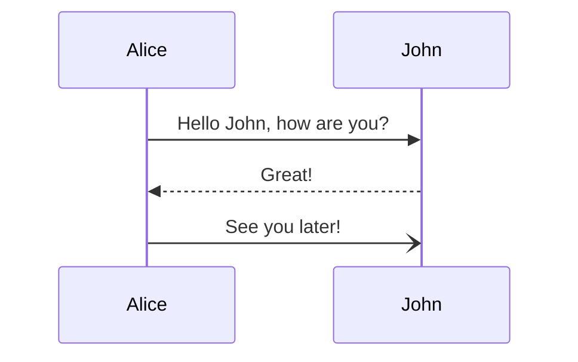

### 语法

#### 参加者

可以像本页第一个示例中那样隐式定义参与者。参与者或参与者按照图表源文本中的出现顺序渲染。有时，你可能希望以不同于第一条消息中的顺序显示参与者。可以通过执行以下操作来指定角色的出场顺序：

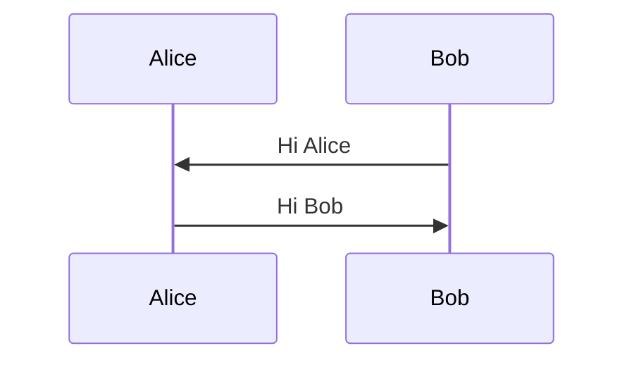

#### 角色

如果你特别想使用角色符号而不是带有文本的矩形，则可以通过使用角色语句来实现，如下所示。

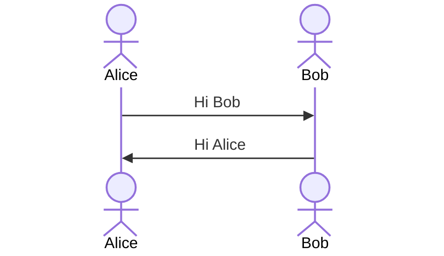

#### 别名

角色可以有一个方便的标识符和描述性标签。

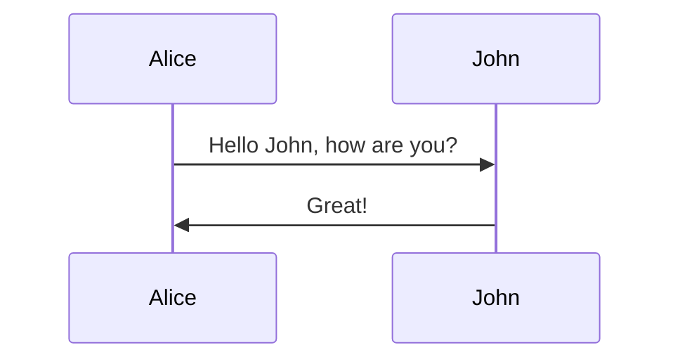

#### Actor 创建和销毁 (v10.3.0+)

可以通过消息创建和销毁参与者。为此，请在消息之前添加创建或销毁指令。

```mermaid
create participant B
A --> B: Hello
```

创建指令支持参与者/参与者区分和别名。消息的发送者或接收者可以被销毁，但只能创建接收者。

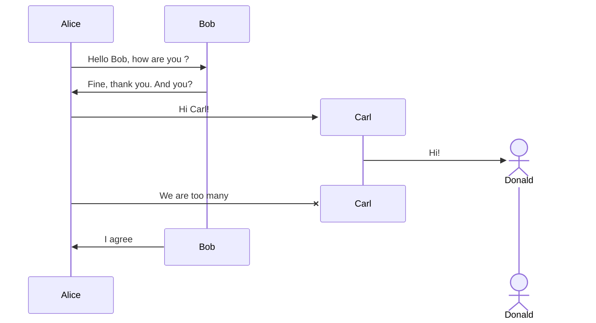

##### 无法修复的参与者/参与者创建/删除错误

> 被销毁的参与者参与者名称在其声明后没有关联的销毁消息。请检查顺序图。

修复图表代码并不能消除此错误，并且所有其他图表的渲染都会导致相同的错误，那么你需要将 mermaid 版本更新到（v10.7.0+）。

#### 分组/框

角色可以分组在垂直框中。你可以使用以下符号定义颜色（如果没有，它将是透明的）和/或描述性标签：

```mermaid
box Aqua Group Description
... actors ...
end
box Group without description
... actors ...
end
box rgb(33,66,99)
... actors ...
end
```

```mermaid
box transparent Aqua
... actors ...
end
```

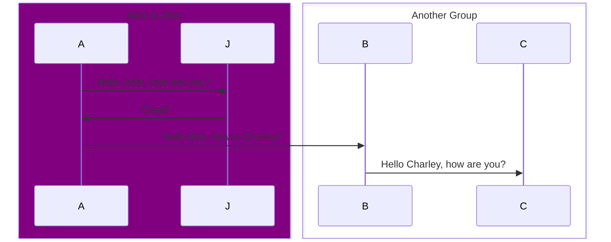

### 信息

消息可以有两条显示，可以是实线，也可以是虚线。

```mermaid
[Actor][Arrow][Actor]:Message text
```

### 激活

可以激活和停用角色。(de)activation 可以是专用声明：

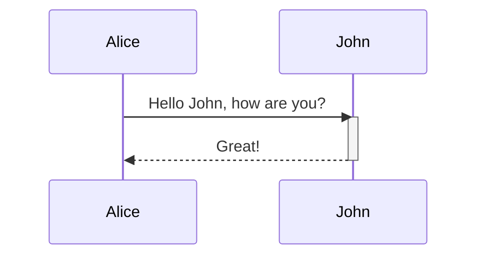

还有一种快捷表示法，即在消息箭头后附加 `+`/`-` 后缀：

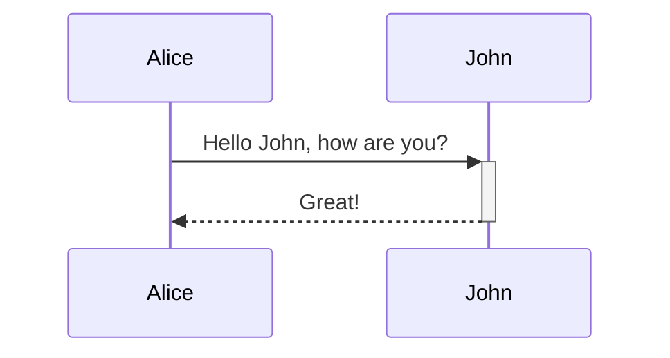

同一角色的激活可以叠加：

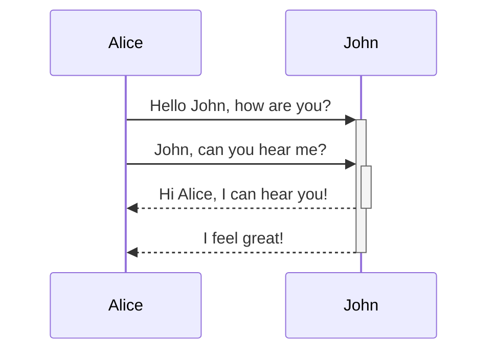

### 注意

可以向序列图添加注释。这是通过符号 Note [ right of | 完成的。 左边| 结束] [角色]：注意内容中的文本

请参阅下面的示例：

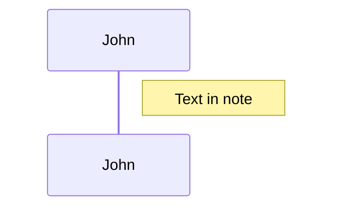

还可以创建跨越两个参与者的注意：

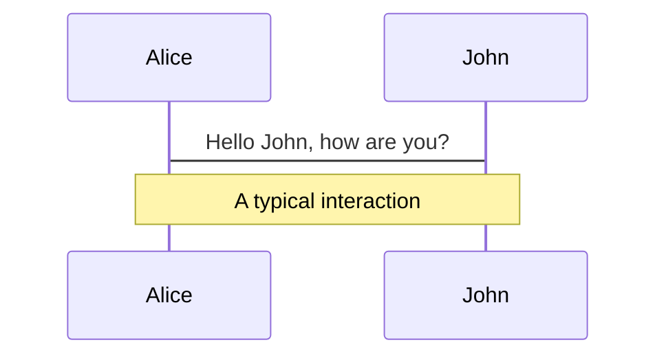

还可以创建跨越两个参与者的注意：

##### 代码:


还可以添加换行符（一般适用于文本输入）：

##### 代码:

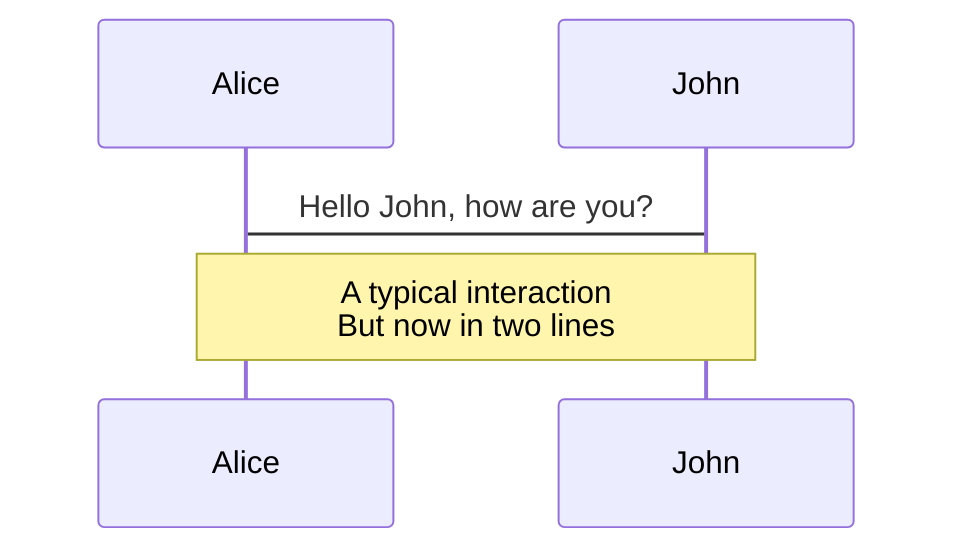

### 循环

可以在序列图中表达循环。这是通过符号完成的

```mermaid
loop Loop text
... statements ...
end
```

请参阅下面的示例：

##### 代码:

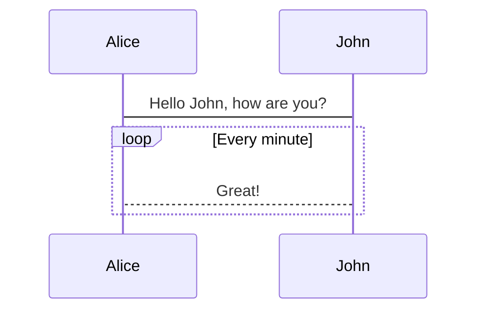

### 替代

可以在序列图中表达替代路径。这是通过符号完成的

```mermaid
alt Describing text
... statements ...
else
... statements ...
end
```

或者如果有可选的序列（如果没有其他）。

```mermaid
opt Describing text
... statements ...
end
```

请参阅下面的示例：

```mermaid
sequenceDiagram
    Alice->>Bob: Hello Bob, how are you?
    alt is sick
        Bob->>Alice: Not so good :(
    else is well
        Bob->>Alice: Feeling fresh like a daisy
    end
    opt Extra response
        Bob->>Alice: Thanks for asking
    end

```

### 平行线

可以显示并行发生的动作。

这是通过符号完成的

```mermaid
par [Action 1]
... statements ...
and [Action 2]
... statements ...
and [Action N]
... statements ...
end
```

请参阅下面的示例：

##### 代码:

```mermaid
sequenceDiagram
    par Alice to Bob
        Alice->>Bob: Hello guys!
    and Alice to John
        Alice->>John: Hello guys!
    end
    Bob-->>Alice: Hi Alice!
    John-->>Alice: Hi Alice!
```

也可以嵌套并行块:

```mermaid
sequenceDiagram
    par Alice to Bob
        Alice->>Bob: Go help John
    and Alice to John
        Alice->>John: I want this done today
        par John to Charlie
            John->>Charlie: Can we do this today?
        and John to Diana
            John->>Diana: Can you help us today?
        end
    end
```

### 临界区

可以通过对情况进行条件处理来显示必须自动发生的操作。

这是通过符号完成的

```mermaid
critical [Action that must be performed]
... statements ...
option [Circumstance A]
... statements ...
option [Circumstance B]
... statements ...
end
```

请参阅下面的示例：

```mermaid
sequenceDiagram
    critical Establish a connection to the DB
        Service-->DB: connect
    option Network timeout
        Service-->Service: Log error
    option Credentials rejected
        Service-->Service: Log different error
    end
```

也有可能根本没有选项

```mermaid
sequenceDiagram
    critical Establish a connection to the DB
        Service-->DB: connect
    end

```

这个关键块也可以嵌套，相当于上面看到的 `par` 语句。

### 中断

可以指示流内序列的停止（通常用于对异常进行建模）。

这是通过符号完成的

```mermaid
break [something happened]
... statements ...
end
```

请参阅下面的示例：

##### 代码:

```mermaid
sequenceDiagram
    Consumer-->API: Book something
    API-->BookingService: Start booking process
    break when the booking process fails
        API-->Consumer: show failure
    end
    API-->BillingService: Start billing process
```

### 背景高亮

可以通过提供彩色背景矩形来高亮流。这是通过符号完成的

颜色是使用 rgb 和 rgba 语法定义的。

```mermaid
rect rgb(0, 255, 0)
... content ...
end
```

```mermaid
rect rgba(0, 0, 255, .1)
... content ...
end
```

请参阅下面的示例：

```mermaid
sequenceDiagram
    participant Alice
    participant John

    rect rgb(191, 223, 255)
    note right of Alice: Alice calls John.
    Alice->>+John: Hello John, how are you?
    rect rgb(200, 150, 255)
    Alice->>+John: John, can you hear me?
    John-->>-Alice: Hi Alice, I can hear you!
    end
    John-->>-Alice: I feel great!
    end
    Alice ->>+ John: Did you want to go to the game tonight?
    John -->>- Alice: Yeah! See you there.


```

### 注释

可以在序列图中输入注释，解析器将忽略这些注释。注释需要独占一行，并且必须以 `%%`（双百分号）开头。注释开始后到下一个换行符的任何文本都将被视为注释，包括任何图表语法

##### 代码:

```mermaid
sequenceDiagram
    Alice->>John: Hello John, how are you?
    %% this is a comment
    John-->>Alice: Great!
```

### 用于转义字符的实体代码

可以使用此处示例的语法对字符进行转义。

```mermaid
sequenceDiagram
    A->>B: I #9829; you!
    B->>A: I #9829; you #infin; times more!

```

给出的数字以 10 为基数，因此 `#` 可以编码为 `#35;`。还支持使用 HTML 字符名称。

由于可以使用分号代替换行符来定义标记，因此你需要使用 `#59;` 在消息文本中包含分号。

### sequenceNumbers

```html
<script>
  mermaid.initialize({ sequence: { showSequenceNumbers: true } });
</script>
```

也可以通过图表代码打开它，如下图所示：

```mermaid
sequenceDiagram
    autonumber
    Alice->>John: Hello John, how are you?
    loop HealthCheck
        John->>John: Fight against hypochondria
    end
    Note right of John: Rational thoughts!
    John-->>Alice: Great!
    John->>Bob: How about you?
    Bob-->>John: Jolly good!
```

可以在序列图中的每个箭头上附加一个序列号。可以在向网站添加 Mermaid 时进行配置，如下所示：

### 角色菜单

参与者可以拥有包含指向外部页面的个性化链接的弹出菜单。例如，如果参与者代表 Web 服务，则有用的链接可能包括指向服务运行状况仪表板的链接、包含服务代码的存储库或描述服务的 wiki 页面。

这可以通过添加一条或多条链接线来配置，格式如下：

```
link <actor>: <link-label> @ <link-url>
```

```mermaid
sequenceDiagram
    participant Alice
    participant John
    link Alice: Dashboard @ https://dashboard.contoso.com/alice
    link Alice: Wiki @ https://wiki.contoso.com/alice
    link John: Dashboard @ https://dashboard.contoso.com/john
    link John: Wiki @ https://wiki.contoso.com/john
    Alice->>John: Hello John, how are you?
    John-->>Alice: Great!
    Alice-)John: See you later!
```

#### 高级菜单语法

有一种依赖于 JSON 格式的高级语法。如果你对 JSON 格式感到满意，那么这也存在。

可以通过添加以下格式的链接行来配置：

```
links <actor>: <json-formatted link-name link-url pairs>
```

```mermaid
sequenceDiagram
    participant Alice
    participant John
    links Alice: {"Dashboard": "https://dashboard.contoso.com/alice", "Wiki": "https://wiki.contoso.com/alice"}
    links John: {"Dashboard": "https://dashboard.contoso.com/john", "Wiki": "https://wiki.contoso.com/john"}
    Alice->>John: Hello John, how are you?
    John-->>Alice: Great!
    Alice-)John: See you later!
```

### 样式

序列图的样式是通过定义许多 CSS 类来完成的。在渲染期间，从位于 src/themes/sequence.scss 的文件中提取这些类

#### 使用的类

| 类             | 描述                          |
| :------------- | :---------------------------- |
| 角色           | 角色框的样式。                |
| actor-top      | 图表顶部的角色人物/框的样式。 |
| actor-bottom   | 图表底部的角色人物/框的样式。 |
| text.actor     | 所有角色的文本样式。          |
| text.actor-box | 角色框的文本样式。            |
| text.actor-man | 角色人物的文本样式。          |
| 角色线         | 角色的垂直线。                |
| messageLine0   | 实心消息行的样式。            |
| messageLine1   | 虚线消息行的样式。            |
| messageText    | 定义消息箭头上的文本样式。    |
| labelBox       | 定义循环左侧的样式标签。      |
| labelText      | 循环标签中文本的样式。        |
| loopText       | 循环框中文本的样式。          |
| loopLine       | 定义循环框中线条的样式。      |
| note           | 注释框的样式。                |
| noteText       | 注释框中文本的样式。          |

#### 样式表示例

```css
body {
  background: white;
}

.actor {
  stroke: #ccccff;
  fill: #ececff;
}
text.actor {
  fill: black;
  stroke: none;
  font-family: Helvetica;
}

.actor-line {
  stroke: grey;
}

.messageLine0 {
  stroke-width: 1.5;
  stroke-dasharray: '2 2';
  marker-end: 'url(#arrowhead)';
  stroke: black;
}

.messageLine1 {
  stroke-width: 1.5;
  stroke-dasharray: '2 2';
  stroke: black;
}

#arrowhead {
  fill: black;
}

.messageText {
  fill: black;
  stroke: none;
  font-family: 'trebuchet ms', verdana, arial;
  font-size: 14px;
}

.labelBox {
  stroke: #ccccff;
  fill: #ececff;
}

.labelText {
  fill: black;
  stroke: none;
  font-family: 'trebuchet ms', verdana, arial;
}

.loopText {
  fill: black;
  stroke: none;
  font-family: 'trebuchet ms', verdana, arial;
}

.loopLine {
  stroke-width: 2;
  stroke-dasharray: '2 2';
  marker-end: 'url(#arrowhead)';
  stroke: #ccccff;
}

.note {
  stroke: #decc93;
  fill: #fff5ad;
}

.noteText {
  fill: black;
  stroke: none;
  font-family: 'trebuchet ms', verdana, arial;
  font-size: 14px;
}
```

### 配置

可以调整渲染序列图的边距。

这是通过定义 `mermaid.sequenceConfig` 或通过 CLI 使用带有配置的 json 文件来完成的。[mermaidCLI](https://mermaid.nodejs.cn/config/mermaidCLI.html) 页描述了如何使用 CLI。`mermaid.sequenceConfig` 可以设置为带有配置参数的 JSON 字符串或相应的对象。

```mermaid
mermaid.sequenceConfig = {
  diagramMarginX: 50,
  diagramMarginY: 10,
  boxTextMargin: 5,
  noteMargin: 10,
  messageMargin: 35,
  mirrorActors: true,
};
```

#### 可能的配置参数：

| 参数              | 描述                                                                                          | 默认值                      |
| :---------------- | :-------------------------------------------------------------------------------------------- | :-------------------------- |
| mirrorActors      | 打开/关闭图表下方和上方参与者的渲染                                                           | false                       |
| 底部边距调整      | 调整图表结束的距离。使用 css 的宽边框样式可能会产生不需要的剪裁，这就是此配置参数存在的原因。 | 1                           |
| 角色字体大小      | 设置角色描述的字体大小                                                                        | 14                          |
| 角色字体家族      | 设置角色描述的字体系列                                                                        | "打开无字体"，无衬线字体    |
| 角色字体粗细      | 设置角色描述的字体粗细                                                                        | "打开无字体"，无衬线字体    |
| noteFontSize      | 设置角色附加注释的字体大小                                                                    | 14                          |
| noteFontFamily    | 设置角色附加注释的字体系列                                                                    | "投石机女士"、verdana、宋体 |
| noteFontWeight    | 设置角色附加注释的字体粗细                                                                    | "投石机女士"、verdana、宋体 |
| noteAlign         | 设置角色附加注释中文本的文本对齐方式                                                          | center                      |
| messageFontSize   | 设置角色<->角色消息的字体大小                                                                 | 16                          |
| messageFontFamily | 设置 actor<->actor 消息的字体系列                                                             | "投石机女士"、verdana、宋体 |
| messageFontWeight | 设置角色<->角色消息的字体粗细                                                                 | "投石机女士"、verdana、宋体 |
